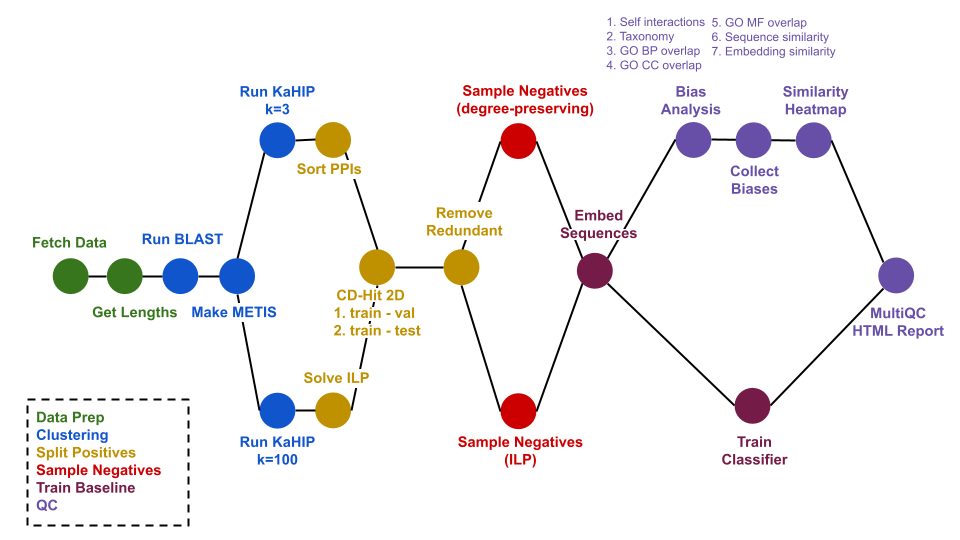

# PPI Splitting Pipeline


Automated leakage-aware splitting of a protein–protein interaction (PPI) dataset into train, validation, and test sets, with redundancy removal, negative sampling, embedding-based classification, and bias analysis.

## Quick Start

### 1. Install dependencies

```bash
conda env create -f environment.yml
conda activate ppi-splitting-pipeline
```

### 2. Prepare your input

Each PPI dataset is a CSV file with at least two columns (`protein1`, `protein2`) containing UniProt accession IDs. Additional columns (e.g. STRING evidence scores) are preserved throughout the pipeline.

```
protein1,protein2
P45985,Q14315
Q86TC9,P35609
O14836-2,P12345
...
```

Then list your dataset(s) in a samplesheet CSV, one row per dataset — see [Multiple datasets (samplesheet)](#multiple-datasets-samplesheet) below for the full column reference.

```
id,ppis
my_dataset,ppis.csv
```

### 3. Run the pipeline

```bash
nextflow run main.nf --samplesheet samplesheet.csv --outdir results
```

If you have a GPU, additionally specify `-profile gpu`, which will submit only the embedding steps to the GPU:

```bash
nextflow run main.nf --samplesheet samplesheet.csv --outdir results -profile gpu -c my_config.config
```

Config example for an HPC with slurm and a dedicated GPU queue: https://nf-co.re/configs/daisybio/. Important part:

```bash
 profiles {
     ...
     gpu {
            docker.runOptions       = '-u $(id -u):$(id -g) --gpus all'
            apptainer.runOptions    = '--nv'
            singularity.runOptions  = '--nv'
        process{
                withLabel:process_gpu {
                    queue = 'shared-gpu'
                    clusterOptions = '--qos=limitgpus --gpus=a40:1 --exclude compms-gpu-1.exbio.wzw.tum.de'
                }
            }
        }
        }
} 
```

### 4. View the report

One combined report for the whole run: open `results/multiqc/multiqc_report.html` in a browser. Content that's comparable across datasets (General Statistics, Classifier Performance, Positive vs Negative Pairs) is merged into one table/chart with an `ID` column identifying the dataset; content that's inherently per-dataset (PPI Partitioning, the similarity heatmap, the bias-analysis scatter plot) appears as its own separate, dataset-labelled panel.

---

## Workflow


### Step descriptions

**FETCH_DATA** — Queries UniProt for the union of unique proteins across every samplesheet dataset that needs a fetch (extracted directly from each dataset's `protein1`/`protein2` columns and deduplicated, no PPI CSVs concatenated). Retrieves sequences (canonical + isoform-specific via the FASTA endpoint), GO annotations (biological process, molecular function, cellular component), and NCBI taxon IDs. Outputs `sequences.fasta`, `go_annotations.tsv`, and `species.tsv`, published to `results/_shared/data/`, then split back out per dataset (`SUBSET_FETCHED_DATA`) — see [Multiple datasets (samplesheet)](#multiple-datasets-samplesheet) below.

**GET_LENGTHS** — Computes per-protein sequence lengths for length-normalized BLAST scores. Runs once on the shared fetch batch (see above) for datasets needing a fetch, and once per dataset for datasets supplying a precomputed `sequences.fasta`.

**RUN_BLAST** — Runs all-against-all BLASTp with `makeblastdb` + `blastp` to quantify pairwise sequence similarity.

**MAKE_METIS** — Converts the BLAST results into a weighted similarity graph in METIS format. Edge weights are either raw bitscore or bitscore normalised by the geometric mean of protein lengths.

**RUN_KAHIP** — Partitions the similarity graph into `k` parts using KaHIP's `kaffpa`. 

- k=3 is used togehter with **SORT_PPIS** to produce the final splits. The largest partition is used as the training set, the second-largest as validation, and the smallest as test.
- k=100 is used together with **SOLVE_ILP**. The clusters are moved to training, validation, and test set while minimizing the data loss and satisfying the constraints.

**SORT_PPIS** — Assigns each PPI to a split based on the KaHIP partition. PPIs are only retained if both partners occur in the same block of the partition. Writes per-split CSV and FASTA files.

**SOLVE_ILP** — Assigns each PPI to a split by solving a mixed-integer linear program (CVXPY) that maximizes the number of retained PPIs while satisfying constraints (each cluster is assigned to 1 split, the train/val/test split follows a pre-defined proportion of 0.8/0.1/0.1). The ILP solver is Gurobi, by default, with the gurobi license file specified via `--gurobi_license`. If no license is available, the open-source solvers SCIP or HiGHS can be used instead.

**SPLIT_RANDOM** — `split_method=random`: a deliberately naive baseline that shuffles PPIs and slices them into train/val/test by proportion only, ignoring sequence similarity or topology entirely. Doesn't discard any PPIs, and its output skips `CDHIT2D`/`REMOVE_REDUNDANT` entirely — see [Naive baseline: the topology shortcut](#naive-baseline-the-topology-shortcut-optional) below.

**CDHIT2D** – Calls CD-HIT 2D between train/val and train/test to identify proteins in val/test that are too similar to any training protein (above the CD-HIT identity threshold). Writes a TSV of redundant proteins for each split. Only runs for `kahip`/`ilp` splits.

**REMOVE_REDUNDANT** — Removes proteins from val and test that are too similar to any training protein using the CD-HIT 2D TSVs. Only runs for `kahip`/`ilp` splits. Its kept-vs-removed counts feed into the same "PPI Partitioning" chart `SORT_PPIS`/`SOLVE_ILP` started (stacked `Kept` vs `Removed (CD-HIT)` for the `train`/`val`/`test` bars).

**SAMPLE_NEGATIVES_DEGREE** — Samples random negative pairs for each split. By default, negatives are drawn such that each protein's degree distribution is approximately preserved, producing a balanced test set (1:1 positive:negative) and a realistic test set (1:10 ratio). With `negative_sampling_method=uniform`, endpoints are instead drawn fully uniformly at random for *every* split (not just the realistic test set) — see [Naive baseline: the topology shortcut](#naive-baseline-the-topology-shortcut-optional) below.

**SAMPLE_NEGATIVES_ILP** – An ILP-based alternative satisfying the size constraints and minimizing biases while maximizing confidence in the negatives;  see [Bias-aware ILP negative sampling](#bias-aware-ilp-negative-sampling-optional) below.

**EMBED_SEQUENCES** — Computes per-protein embeddings using the selected model:
- `none` — 21-dimensional mean-pooled one-hot amino acid composition
- `esm2` — ESM-2 650M (dimension 1280), mean-pooled over residues
- `prot_t5` — ProtT5-XL (dimension 1024), mean-pooled over residues
- A path to a pre-computed `.npz` file skips this step entirely.

Every samplesheet dataset requesting the same model is embedded together in
one call over the union of their train/val/test sequences, published once to
`results/_shared/embeddings/embeddings_<model>.npz` (not duplicated per
dataset).

**TRAIN_CLASSIFIER** — Trains a Random Forest classifier on concatenated pair embeddings. Hyperparameters are tuned on the validation AUROC over 3 configurations (max_depth 5/10/30, max_samples 0.2), then the best model is retrained on train+val and evaluated on the balanced and realistic test sets.

**BIAS_ANALYSIS** — Runs in parallel for each attribute, computing:
- *Utility* — NMI(A; Y) = MI / √(H(A)·H(Y)): how much the attribute is correlated with the PPI label
- *Detectability* — Spearman ρ of a Ridge regressor predicting the attribute from pair embeddings

Attributes analyzed:

| Attribute                         | Description                                                                                                                               |
|-----------------------------------|-------------------------------------------------------------------------------------------------------------------------------------------|
| `sequence_similarity`             | BLASTp pident between the two proteins, normalized to [0, 1]                                                                              |
| `embedding_similarity`            | Cosine similarity of the two individual protein embeddings                                                                                |
| `functional_relatedness_BP/MF/CC` | Jaccard similarity of GO term sets (biological process / molecular function / cellular component)                                         |
| `self_interactions`               | 1 if both proteins are identical, 0 otherwise                                                                                             |
| `same_species`                    | 1 if both proteins share the same NCBI taxon ID, 0 otherwise (only included if the dataset contains proteins from more than one species)  |
| `topology_shortcut`               | Each endpoint's training positive-rate (pos / (pos + neg) training degree), using whichever endpoint(s) occurred in training; only included if at least one val/test/test_balanced/test_realistic pair has an endpoint that occurred in training — see [Naive baseline: the topology shortcut](#naive-baseline-the-topology-shortcut-optional) below |

**COLLECT_BIAS** — Aggregates all per-attribute TSVs into a single interactive Plotly scatter plot (NMI vs detectability, colored by attribute, shaped by split).

**SIMILARITY_HEATMAP** — Plots a heatmap of pairwise BLASTp similarity between proteins in different splits, to visualize the degree of leakage.

**MULTIQC** — Collects every dataset's `*_mqc.tsv`/`*_mqc.html` files into one combined report for the whole run (`results/multiqc/`). Per-attribute bias tables are excluded (the bias-scatter plot supersedes them); General Statistics, Classifier Performance, and Positive vs Negative Pairs are merged across datasets (qualified sample names + an `ID` column); PPI Partitioning, the similarity heatmap, and the bias-scatter plot remain one separate panel per dataset.

---

## Outputs

Every dataset from the samplesheet gets its own subtree under `--outdir`, named by its `id` column. Work shared across datasets (the deduplicated UniProt fetch and any embeddings shared by datasets requesting the same model) lives under a separate `_shared/` folder rather than being duplicated into every dataset's subtree. The combined MultiQC report for the whole run lives at the top level, `results/multiqc/`:

```
results/
├── _shared/
│   ├── data/                         # One deduplicated UniProt fetch batch (see Multiple datasets below)
│   │   └── sequences.fasta, go_annotations.tsv, species.tsv
│   └── embeddings/
│       └── embeddings_<model>.npz    # One file per distinct embedding_model requested across datasets
├── multiqc/
│   ├── multiqc_report.html           # One combined report for the whole run
│   └── multiqc_report_data/          # MultiQC data folder
└── <id>/
    ├── multiqc/
    │   └── similarity_heatmap.html   # Standalone copy of this dataset's heatmap (also embedded in the combined report)
    ├── data/
    │   └── go_annotations.tsv        # GO annotations for this dataset's own proteins
    │   └── sequences.fasta           # FASTA for this dataset's own proteins
    │   └── species.tsv               # NCBI taxon IDs for this dataset's own proteins
    ├── similarities/
    │   └── all_vs_all.tsv            # BLAST evalue, bitscore and pident between this dataset's own proteins
    │   └── similarity.graph          # KaHIP input graph = all vs. all similarity graph (weighted edges) in METIS format
    │   └── node_mapping.tsv          # KaHIP just enumerates nodes, this maps them to protein IDs
    │   └── partitioned_proteome.txt  # KaHIP partitioned proteome (protein IDs) 
    ├── train.csv                     # Final labelled splits (positives + negatives)
    ├── val.csv
    ├── test_balanced.csv
    └── test_realistic.csv            # with 1:10 ratio of positives:negatives, negatives are uniformly sampled
```

`data/sequences.fasta` (and its `go_annotations.tsv`/`species.tsv`) is
always this dataset's own subset, even for datasets whose UniProt fetch was
folded into a shared batch with other datasets — this matters most for
`similarities/all_vs_all.tsv`, since BLAST's E-value/bitscore statistics
depend on exactly which proteins are in its search database, so it always
runs per-dataset even when the underlying sequences came from a shared fetch.

---

## Multiple datasets (samplesheet)

`--samplesheet` takes a CSV with one row per PPI dataset. Only `id` and `ppis`
are required — every other column may be left blank, in which case that
dataset falls back to the corresponding `nextflow.config` default. This makes
it possible to process several datasets with different parameters in a single
`nextflow run` invocation, all running in parallel:

```
id,ppis,split_method,negative_sampling_method,cdhit_identity,neg_ilp_lambda_jaccard
hippie,data/HIPPIE-current.csv,,,,
string,data/string.csv,ilp,ilp,0.5,0.5
```

| Column                                                                 | Overrides                   | Notes                                                                                                                            |
|------------------------------------------------------------------------|-----------------------------|----------------------------------------------------------------------------------------------------------------------------------|
| `id`                                                                   | —                           | Required. Used as the output subfolder name (`results/<id>/...`) and in logs.                                                    |
| `ppis`                                                                 | —                           | Required. Path to this dataset's PPI CSV.                                                                                        |
| `sequences`, `go_annotations`, `species`                               | UniProt fetch step          | Supply all three to skip `FETCH_DATA` for this dataset.                                                                          |
| `blast_results`                                                        | BLAST step                  | Supply to skip `RUN_BLAST` for this dataset (a precomputed `all_vs_all.tsv`).                                                    |
| `candidate_network`                                                    | —                           | Optional candidate pool CSV for the ILP negative sampler.                                                                        |
| `embedding_model`, `cdhit_identity`, `cdhit_wordsize`                  | `params.*` of the same name | Defaults: `embedding_model`: esm2, `cdhit_identity`: 0.4, `cdhit_wordsize`: 2                                                    |
| `split_method`, `edge_weight`, `kahip_k`, `ilp_kahip_k`, `ilp_epsilon` | `params.*` of the same name | Defaults: `split_method`: kahip (k=3), `edge_weight`: normalized_bitscore, `kahip_k`: 3, `ilp_kahip_k`: 100, `ilp_epsilon`: 0.05. `split_method=random` is a naive baseline, see below |
| `train_split`, `val_split`, `test_split`                               | `params.*` of the same name | Defaults: 0.8, 0.1, 0.1                                                                                                          |
| `negative_sampling_method`                                             | `params.*` of the same name | Defaults: default (alternatives: ilp, uniform — see below)                                                                        |
| `neg_ilp_alpha_confidence`, `neg_ilp_alpha_bias`                       | `params.*` of the same name | Only used when `negative_sampling_method` is `ilp`; see [Bias-aware ILP negative sampling](#bias-aware-ilp-negative-sampling-optional) below. Highly dataset-specific, so overridable per row rather than fixed run-wide. |
| `neg_ilp_lambda_degree`, `neg_ilp_lambda_taxon_pair`, `neg_ilp_lambda_self_loop`, `neg_ilp_lambda_jaccard` | `params.*` of the same name | Same as above.                                                                                                    |

Everything else (solver settings, Gurobi license, resource limits, seeds,
`neg_ilp_degree_bias_mode`, ...) stays a run-wide default in
`nextflow.config` and is shared by every dataset in the samplesheet.

**Deduplicated work across datasets.** Datasets often overlap in which
proteins they contain, so two things are computed once per run rather than
once per dataset:
- **UniProt fetch**: every dataset that needs a fetch (doesn't supply
  `sequences`/`go_annotations`/`species`) has its unique proteins extracted
  and pooled with every other such dataset's, fetched together once, then
  split back out per dataset. BLAST still runs once per dataset on its own
  subset — see [Outputs](#outputs) above for why that matters.
- **Embeddings**: every dataset requesting the same `embedding_model` shares
  one embedding computation over the union of their sequences.

Both are purely a compute/storage optimization — a dataset in a mixed run
with others produces the same `train.csv`/`val.csv`/etc. it would if run
alone.

---

## Naive baseline: the topology shortcut (optional)

Many PPI-splitting publications randomly split pairs 80/10/10 and sample
negatives uniformly at random. This inflates reported performance: positive
degree follows a power law while uniform-random negatives don't, so a
protein's *training* degree — specifically what fraction of its training
interactions are positive, `pos_degree_in_training(p) /
(pos_degree_in_training(p) + neg_degree_in_training(p))` — becomes
predictive of the label by itself, especially for proteins at the extremes
of the degree distribution. A model can exploit this "topology shortcut"
instead of learning any real interaction signal, because a naive random
split lets the same protein land in both training and test.

Reproduce this deliberately-bad setup with:

```bash
nextflow run main.nf --split_method random --negative_sampling_method uniform
```

(or per-dataset via the samplesheet's `split_method`/`negative_sampling_method`
columns, see [Multiple datasets](#multiple-datasets-samplesheet) above).
`split_method=random` (`SPLIT_RANDOM`) shuffles PPIs and slices them by
proportion only — no homology- or topology-aware partitioning — and,
critically, **skips `CDHIT2D`/`REMOVE_REDUNDANT` entirely**: since those
steps treat a protein shared between train and test as trivially
~100%-self-similar and strip it back out of test, running them here would
erase almost all of the train/test protein overlap this baseline exists to
demonstrate. `negative_sampling_method=uniform` draws negatives fully
uniformly at random for every split (not just the realistic test set),
matching how the "many publications" this baseline is modeled on sample
negatives.

The `topology_shortcut` bias attribute (see the Attributes table above)
quantifies exactly this effect: it's only computed for pairs where at least
one endpoint occurred in training, and the whole attribute is skipped (no
MultiQC output at all) when *no* val/test/test_balanced/test_realistic pair
qualifies — which is the normal, expected case for the real `kahip`/`ilp`
splits, since those keep train/val/test protein sets disjoint by design.
Run a `random`-split dataset alongside a `kahip`/`ilp`-split dataset on the
same PPI data in one samplesheet to see the difference directly: the naive
baseline's report will show a `topology_shortcut` table with elevated
NMI/detectability that the leakage-aware splits' reports won't show at all.

---

## Bias-aware ILP negative sampling (optional)

`SAMPLE_NEGATIVES_ILP` is an opt-in alternative to `SAMPLE_NEGATIVES` that chooses
the negative set by solving a mixed-integer linear program (CVXPY), rather than
sampling at random. It matches per-protein per-taxon interaction counts,
self-interaction counts, and mean GO-BP Jaccard similarity between the positive
and negative sets, while preferring high-confidence non-interactions when a
confidence score is supplied. `bin/sample_negatives_ilp.py` samples exactly one
split per invocation; the process runs once per split (train, val,
test_balanced, test_realistic) and Nextflow executes all four in parallel.
Together they produce the same four output files (`train.csv`, `val.csv`,
`test_balanced.csv`, `test_realistic.csv`) as the default sampler, so all
downstream steps are unaffected. See `sample_negatives_SPEC.md` and
`ppi_negative_sampling_ilp.tex` for the full mathematical derivation.

Enable it with:

```bash
nextflow run main.nf --negative_sampling_method ilp
```

The `--neg_ilp_alpha_*` and `--neg_ilp_lambda_*` weights are highly
dataset-specific (they depend on each dataset's degree distribution, taxon
composition, and GO annotation coverage), so when running multiple datasets
via `--samplesheet` they are set **per row**, not as a single run-wide value —
see the samplesheet column reference in
[Multiple datasets (samplesheet)](#multiple-datasets-samplesheet) above. The
values below are just the `nextflow.config` fallback used for any row that
leaves them blank.

| Parameter                                           | Default       | Description                                                                                                                                                                  |
|-----------------------------------------------------|---------------|------------------------------------------------------------------------------------------------------------------------------------------------------------------------------|
| `negative_sampling_method`                          | `default`     | `default` (random) or `ilp`                                                                                                                                                  |
| `candidate_network`                               | `null`        | Optional CSV (`protein1,protein2[,w]`) restricting the candidate pool, e.g. a Negatome database or a topology-driven pool. Required for large protein universes (see below). |
| `neg_ilp_alpha_confidence` / `--neg_ilp_alpha_bias` | `0.3` / `0.7` | Trade-off between confidence loss and bias matching (must sum to 1)                                                                                                          |
| `neg_ilp_lambda_degree`                           | `0.6`         | Weight of the per-protein (per-taxon, in `unified` mode) degree-matching term                                                                                                |
| `neg_ilp_lambda_taxon_pair`                       | `0.0`         | Weight of the global taxon-pair matching term (`split` mode only)                                                                                                            |
| `neg_ilp_lambda_self_loop`                        | `0.1`         | Weight of the self-interaction count matching term                                                                                                                           |
| `neg_ilp_lambda_jaccard`                          | `0.3`         | Weight of the mean GO-BP Jaccard matching term                                                                                                                               |
| `neg_ilp_degree_bias_mode`                        | `unified`     | `unified` (single per-protein-per-taxon term) or `split` (separate per-protein degree and taxon-pair terms)                                                                  |
| `neg_ilp_solver`                                  | `auto`        | `auto`, `gurobi`, `scip`, or `highs`. `auto` tries Gurobi first, then falls back to an open-source solver.                                                                   |
| `neg_ilp_time_limit`                              | `3600`        | Solver time limit in seconds                                                                                                                                                 |
| `neg_ilp_mip_gap`                                 | `0.01`        | Solver MIP gap tolerance                                                                                                                                                     |
| `gurobi_license`                                  | `null`        | Path to a Gurobi license file, only used if the `gurobi` solver is selected                                                                                                  |

The active `--neg_ilp_lambda_*` weights (for the chosen `degree_bias_mode`) must
sum to 1; a mismatch is auto-rescaled with a warning unless the script is run
with `--strict-weights` directly (not exposed as a pipeline parameter).

For Gurobi, install it yourself and point `--gurobi_license` at your license
file (`pip install gurobipy` is already pulled in by `environment.yml`). With
no usable Gurobi license, `auto` falls back to SCIP or HiGHS, both installed
by `environment.yml`.

The default candidate pool is the full upper-triangle complement of the
positive set, which is quadratic in the number of proteins (~1.1×10⁸ pairs for
15k proteins). For large datasets, supply `--candidate_network` to restrict
the pool, or the script will raise a clear error before attempting to build it.

Each split's process writes its own `<split>_mqc.tsv` diagnostics row and,
optionally, `<split>_residuals_mqc.tsv` (per-protein degree residuals); MultiQC
picks up all of them.

---

## Standalone STRING channel analysis

To investigate which STRING evidence channels explain classifier performance differences between datasets, use the standalone script (not part of the Nextflow pipeline):

```bash
python bin/analyse_string_channels.py \
    --train      results/<id>/train.csv \
    --test       results/<id>/test_balanced.csv \
    --embeddings results/_shared/embeddings/embeddings_<model>.npz \
    --out        string_channel_analysis.tsv
```

This fits a Ridge regressor (on positive pairs only) to predict each STRING evidence channel score from pair embeddings, and reports train and test Spearman ρ per channel. `combined_score` is excluded since it is derived from the individual channels.

---

## Requirements

- [Nextflow](https://www.nextflow.io/) ≥ 23.10
- Conda (for the environment) — or install the packages in `environment.yml` manually
- Internet access for the initial UniProt fetch (subsequent runs use cached Nextflow work directories)
- A GPU is recommended but not required for `esm2` and `prot_t5` embedding models
