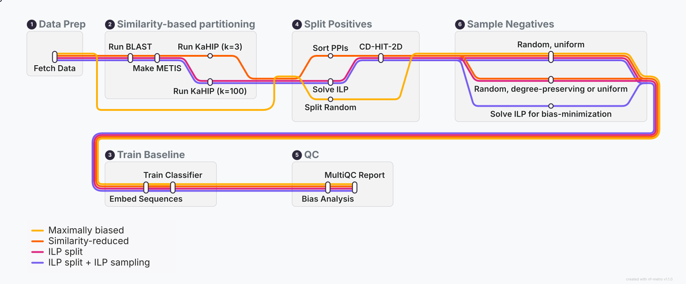

Automated leakage-aware splitting of a protein–protein interaction (PPI) dataset into train, validation, and test sets, with redundancy removal, negative sampling, embedding-based classification, and bias analysis.

Have a look at the [Wiki](https://github.com/bionetslab/ppi-splitting-pipeline/wiki) for more information.




---

## Requirements

- [Nextflow](https://www.nextflow.io/) ≥ 26
- Conda (for the environment) — or install the packages in `environment.yml` manually
- Internet access for the initial UniProt fetch (subsequent runs use cached Nextflow work directories)
- A GPU is recommended but not required for `esm2` and `prot_t5` embedding models

---

## Quick Start

### Input PPI File

To custom-split your PPI dataset, you need to provide it to the pipeline as a CSV file with at least two columns (`protein1`, `protein2`) containing UniProt accession IDs. Additional columns (e.g., STRING evidence scores) are preserved throughout the pipeline.

```
protein1,protein2
P45985,Q14315
Q86TC9,P35609
O14836-2,P12345
...
```

### Samplesheet preparation

You provide all parameters for the pipeline via a samplesheet CSV where one row corresponds to one run. E.g., :

| id        | ppis             | split_method | negative_sampling_method | neg_ilp_solver | gurobi_license     |
|-----------|------------------|--------------|--------------------------|----------------|--------------------|
| fast-run  | data/my_ppis.csv | kahip        | default                  |                |                    |
| split-ilp | data/my_ppis.csv | ilp          | default                  |                |                    |
| all-ilp   | data/my_ppis.csv | ilp          | ilp                      | gurobi         | path/to/gurobi.lic |

### Run the pipeline

If you have a GPU, `-profile gpu` will submit the embedding step to a GPU, as specified by your nextflow config.

```
nextflow run main.nf --samplesheet samplesheet.csv --outdir results -profile gpu -c my_config.config
```

In `my_config.config`, you have to specify where the GPU is located. SLURM example:

```
profiles {
    ...
    gpu {
        process {
            withLabel:process_gpu {
                queue = 'shared-gpu'
                clusterOptions = '--qos=limitgpus --gpus=a40:1 --exclude small-gpu'
            }
        }
    }
}
```

### View the report

The MultiQC report can be found at `results/multiqc/multiqc_report.html`, which you can view in a browser.

